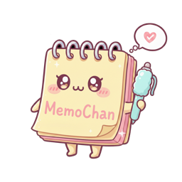

# MemoChan



A code editor with syntax highlighting and Markdown preview, built with the egui GUI framework.


## About

MemoChan is a code editor designed for everyday note-taking, text editing, and Markdown document creation. It provides syntax highlighting, Markdown preview, and essential features you would expect from a modern editor.

**This application was implemented by the GLM5 AI model.**

## Features

- **Syntax Highlighting**: Automatic language detection with support for 100+ languages, or manual language selection
- **Markdown Preview**: Live preview with Tabs or Side-by-Side layout (Markdown files only)
- **Search**: Find text with wrap-around search and keyboard navigation
- **File Operations**: New, Open, Save, Save As
- **Undo/Redo**: Full undo/redo support with history stack
- **Word Wrap**: Toggle line wrapping for better readability
- **Zoom**: Zoom in/out with font size adjustment (Ctrl only, all platforms)
- **Theme Support**: System, Light, and Dark themes
- **Status Bar**: Shows current line, column, language, zoom level, and encoding (UTF-8)
- **Time/Date Insertion**: Insert current date and time

## Menu Structure

### File

| Item       | Shortcut                       |
| ---------- | ------------------------------ |
| New        | `Ctrl+N` / `Cmd+N`             |
| Open...    | `Ctrl+O` / `Cmd+O`             |
| Save       | `Ctrl+S` / `Cmd+S`             |
| Save As... | `Shift+Ctrl+S` / `Shift+Cmd+S` |
| Exit       | -                              |

### Edit

| Item      | Shortcut       |
| --------- | -------------- |
| Undo      | `Ctrl+Z` / `Cmd+Z` |
| Redo      | `Ctrl+Y` / `Cmd+Y` |
| Find      | `Ctrl+F` / `Cmd+F` |
| Time/Date | `F5`           |

### View

| Item          | Shortcut                        |
| ------------- | ------------------------------- |
| Zoom In       | `Ctrl++`                        |
| Zoom Out      | `Ctrl+-`                        |
| Reset Zoom    | `Ctrl+0`                        |
| Status Bar    | Toggle visibility               |
| Preview       | Toggle (Markdown only)          |
| Layout        | Tabs / Side by Side (Markdown)  |
| Switch Tab    | `Ctrl+P` / `Cmd+P`              |
| Theme         | System / Light / Dark           |

### Language

| Item | Description                        |
| ---- | ---------------------------------- |
| Auto | Automatic language detection       |
| ...  | Manual language selection (100+)   |

### Format

| Item      | Description          |
| --------- | -------------------- |
| Word Wrap | Toggle line wrapping |

### Help

| Item           | Description       |
| -------------- | ----------------- |
| About MemoChan | Show about dialog |

## Keyboard Shortcuts

| Action          | Windows/Linux              | macOS                    |
| --------------- | -------------------------- | ------------------------ |
| New File        | `Ctrl+N`                   | `Cmd+N`                  |
| Open File       | `Ctrl+O`                   | `Cmd+O`                  |
| Save File       | `Ctrl+S`                   | `Cmd+S`                  |
| Save As         | `Shift+Ctrl+S`             | `Shift+Cmd+S`            |
| Undo            | `Ctrl+Z`                   | `Cmd+Z`                  |
| Redo            | `Ctrl+Y` or `Ctrl+Shift+Z` | `Cmd+Y` or `Cmd+Shift+Z` |
| Find            | `Ctrl+F`                   | `Cmd+F`                  |
| Next Search     | `Enter` or `Down`          | `Enter` or `Down`        |
| Previous Search | `Up`                       | `Up`                     |
| Close Search    | `Esc`                      | `Esc`                    |
| Switch Tab      | `Ctrl+P`                   | `Cmd+P`                  |
| Zoom In         | `Ctrl++`                   | `Ctrl++`                 |
| Zoom Out        | `Ctrl+-`                   | `Ctrl+-`                 |
| Reset Zoom      | `Ctrl+0`                   | `Ctrl+0`                 |
| Time/Date       | `F5`                       | `F5`                     |
| Close Dialog    | `Esc` or `Enter`           | `Esc` or `Enter`         |

## Requirements

- Rust 1.93 or later
- macOS, Windows, or Linux

## Supported Platforms

| OS      | Architecture          | Status       |
| ------- | --------------------- | ------------ |
| macOS   | amd64 (Intel)         | ✅ Tested    |
| macOS   | arm64 (Apple Silicon) | ✅ Supported |
| Linux   | amd64                 | ✅ Supported |
| Linux   | arm64                 | ✅ Tested    |
| Windows | amd64                 | ✅ Supported |
| Windows | arm64                 | ✅ Supported |

## Build

> **Note**: Cross-build and cross-bundle are only supported on **macOS** due to required toolchains. On Linux or Windows, build natively or use CI/CD.

### Native Build

Build and run on your current platform:

```bash
cargo run --release
```

**Platform-specific notes:**

| Platform | Command | Output |
|----------|---------|--------|
| macOS | `cargo run --release` | `target/release/memochan` |
| Linux | `cargo run --release` | `target/release/memochan` |
| Windows | `cargo run --release` | `target/release/memochan.exe` |

### Cross-build (macOS only)

#### macOS to Linux (Cross-build)

To build Linux binaries (Debian package, AppImage) on macOS, follow these steps.

**1. Prerequisites (Common)**

Install the necessary tools and cross-compilation toolchains:

```bash
# Add the cross-toolchains tap
brew tap messense/macos-cross-toolchains

# Install common tools
brew install squashfs
cargo install cargo-bundle
```

**2. Build for Linux AMD64**

```bash
# Install toolchain and target
brew install x86_64-unknown-linux-gnu
rustup target add x86_64-unknown-linux-gnu

# Build bundle
CARGO_TARGET_X86_64_UNKNOWN_LINUX_GNU_LINKER=x86_64-unknown-linux-gnu-gcc \
cargo bundle --release --target x86_64-unknown-linux-gnu
```

**3. Build for Linux ARM64**

```bash
# Install toolchain and target
brew install aarch64-unknown-linux-gnu
rustup target add aarch64-unknown-linux-gnu

# Build bundle
CARGO_TARGET_AARCH64_UNKNOWN_LINUX_GNU_LINKER=aarch64-unknown-linux-gnu-gcc \
cargo bundle --release --target aarch64-unknown-linux-gnu
```

#### macOS to Windows (Cross-build)

> **Note**: Creating Windows installers (`.msi`) requires WiX Toolset, which is not available on macOS. These steps will generate standalone executables (`.exe`) instead.

**1. Build for Windows AMD64**

To build the Windows AMD64 binary (.exe) on macOS:

1. **Install MinGW-w64:**

   ```bash
   brew install mingw-w64
   ```

2. **Add the Rust target:**

   ```bash
   rustup target add x86_64-pc-windows-gnu
   ```

3. **Build the binary:**

   ```bash
   cargo build --release --target x86_64-pc-windows-gnu
   ```

   The executable will be in `target/x86_64-pc-windows-gnu/release/memochan.exe`.

   **Optional: Create Installer (NSIS)**

   To create a Windows installer:

   ```bash
   brew install nsis
   ./scripts/build_installer.sh
   ```

   The installer will be created at `target/x86_64-pc-windows-gnu/release/bundle/`.

**2. Build for Windows ARM64**

To build the Windows ARM64 binary on macOS, using `cargo-xwin` is recommended:

1. **Install cargo-xwin:**

   ```bash
   cargo install cargo-xwin
   ```

2. **Add the Rust target:**

   ```bash
   rustup target add aarch64-pc-windows-msvc
   ```

3. **Build the binary:**

   ```bash
   cargo xwin build --release --target aarch64-pc-windows-msvc
   ```

   The executable will be in `target/aarch64-pc-windows-msvc/release/`.

   **Optional: Create Installer (NSIS)**

   ```bash
   brew install nsis
   ./scripts/build_installer.sh aarch64-pc-windows-msvc
   ```

   The installer will be created at `target/aarch64-pc-windows-msvc/release/bundle/`.

## Running from Source

1. Clone the repository:

   ```bash
   git clone https://github.com/ppugend/memochan.git
   cd memochan
   ```

2. Build and run:
   ```bash
   cargo run --release
   ```

### Development Build

```bash
cargo run
```

## Technology Stack

- **GUI Framework**: [egui](https://www.egui.rs/) 0.30 / eframe
- **Syntax Highlighting**: [syntect](https://github.com/trishume/syntect)
- **Markdown Rendering**: [egui_commonmark](https://github.com/lampsitter/egui_commonmark)
- **Language**: Rust
- **Font**: Pretendard Variable

## License

This project is licensed under the MIT License - see the [LICENSE](LICENSE) file for details.

## Author

**Ppugend**

---

_Made with AI assistance_
